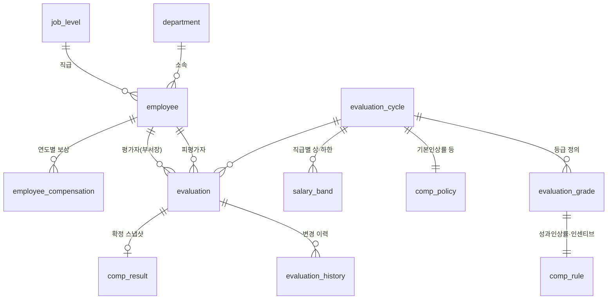

# 업적평가 · 개인 보상 시뮬레이션 시스템 – 스키마 설계안

## 1. 요구사항 정리

| # | 요구사항 | 스키마 대응 |
|---|---------|-------------|
| 1 | 당해 평가결과로 차년도 연봉·인센티브 결정 | `eval_year = N` → `comp_year = N+1` 규칙, `employee_compensation` |
| 2 | 개인평가 5등급 (A~E) | `evaluation_grade` (주기별) |
| 3 | 총인상률 = 기본인상률 + 성과인상률 | `comp_policy.base_up_rate` (전원 공통) + `comp_rule.perf_raise_rate` |
| 4 | 성과인상률은 **개인 평가등급으로만** 결정. A·B·C 양수 / D 동결 / E 음수 | `comp_rule` (등급당 1건) + `evaluation_grade.raise_sign` + 트리거 검증 |
| 5 | 인센티브는 A·B 등급만 지급 | `evaluation_grade.incentive_eligible` + 계산 함수에서 비대상 0 처리 + 트리거 검증 |
| 6 | 부서장 입력 즉시 차년도 연봉·인센티브 확인 | 웹 화면 + `fn_simulate_comp()` |
| 7 | 전년 대비 증감액 | `delta_base_salary`, `delta_incentive`, `delta_total` |
| 8 | 세부 수치·산식은 추후 확정 | 계산식은 `fn_simulate_comp()` 한 곳, 수치는 `comp_policy`/`comp_rule` 테이블 |

## 2. ERD



## 3. 테이블 요약

| 영역 | 테이블 | 설명 |
|------|--------|------|
| 인사 | `department`, `job_level`, `employee` | 조직(본부-팀/Lab 계층)·직급(CL2/CL3/CL4)·직원 마스터 |
| 계정 | `user_account` | 로그인 계정 (ID = 사번, scrypt 비밀번호 해시, 변경 강제 여부, 실패 횟수·잠금, 최근 로그인) |
| 권한 | `app_user_role` | 시스템 역할 (`HR_ADMIN` = 인사팀 부서별 현황 조회). 부서장 권한은 `department.head_employee_id` 로 자동 부여 |
| 평가 | `evaluation_cycle` | 연 1회 평가주기. 상태: DRAFT → OPEN → CALIBRATION → CONFIRMED → CLOSED. `top_grade_ratio_limit` = 상위평가(A·B) 비율 상한 (40%) |
| | `evaluation_grade` | A~E 등급. `raise_sign`(POSITIVE/ZERO/NEGATIVE), `incentive_eligible`, `is_top_grade`(상위평가율 산정) |
| | `grade_distribution_guide` | (선택) 등급별 배분 비율 가이드 – 현재 미사용 (상위평가율 기준으로 대체) |
| | `evaluation` | 부서장이 입력하는 평가. 직원당 주기별 1건 |
| | `evaluation_history` | 등급·상태 입력/변경 시 트리거로 자동 기록. 변경자는 로그인 사용자 사번 |
| 정책 | `comp_policy` | 기본인상률, 절사 단위/방식, 인센티브 기준(당해/차년 연봉), 전사 지급률 |
| | `comp_rule` | 등급별 연봉등급·성과인상률·인센티브율·정액 인센티브 (등급당 1건) |
| | `salary_band` | (선택) 직급별 연봉 상·하한 |
| 보상 | `employee_compensation` | 연도별 확정 연봉·인센티브 (전년 대비 계산의 기준) |
| | `comp_result` | 확정 시점 계산 결과 스냅샷 (이후 정책이 바뀌어도 불변) |

### 등급 정책 강제 (`comp_rule` 트리거)

| 등급 | raise_sign | 성과인상률 | 인센티브 |
|------|-----------|-----------|---------|
| A | POSITIVE | > 0 | 지급 |
| B | POSITIVE | > 0 | 지급 |
| C | POSITIVE | > 0 | 0 이어야 함 |
| D | ZERO | = 0 (동결) | 0 이어야 함 |
| E | NEGATIVE | < 0 | 0 이어야 함 |

규칙에 어긋나는 수치를 넣으면 DB가 오류를 내며 저장을 거부합니다.

## 4. 계산 로직 (현재 기본안)

```
총인상률       = 기본인상률(전원 공통) + 성과인상률(개인 평가등급)
차년 연봉(원)  = 절사(당해 연봉 × (1 + 총인상률), 절사단위)
차년 연봉      = 직급 밴드 [min, max] 범위로 보정 (보정 시 band_capped = true)
차년 인센티브  = A·B 등급: 절사(기준연봉 × 인센티브율 × 전사 지급률 + 정액)   ← 산식 확정 전 임시
                 C·D·E 등급: 0
증감액         = 차년 − 당해 (연봉 / 인센티브 / 총보상 각각)
```

> E 등급은 성과인상률이 음수지만, 기본인상률과 합한 **총인상률**은 수치에 따라 양수가 될 수 있습니다
> (예: 기본 2% + E −1% = +1%). 총인상률 자체를 음수로 만들지는 수치 확정 시 결정 필요.

## 5. 처리 흐름

1. **정책 설정 (DRAFT)** – 인사팀이 주기, 등급, `comp_policy`, `comp_rule`, `salary_band` 등록
2. **평가 입력 (OPEN)** – 부서장 웹 화면
   - 등급 선택 시 `PUT /api/departments/{부서}/evaluations/{직원}` → 임시저장 후 `fn_simulate_comp()` 결과를 행에 즉시 반영
   - 화면 하단에서 상위평가(A·B) 비율 확인 – `evaluation_cycle.top_grade_ratio_limit`(40%) 초과 시 경고
   - 전원 입력 후 제출(SUBMITTED) → 수정 잠금
3. **조정 (CALIBRATION)** – 인사팀이 부서별 현황(상위평가율·평균 성과인상률)을 보고 조정, 변경 이력 자동 기록
4. **확정 (CONFIRMED)** – `SELECT fn_confirm_cycle(:cycle)`
   - 미입력/미제출 건, 당해 연봉 누락 건이 있으면 오류
   - `comp_result` 스냅샷 저장 + `employee_compensation`에 차년도 행 생성

## 6. 샘플 실행 결과 (`db/seed_sample.sql`, 모든 수치 임시값)

기본인상률 2%

| 등급 | 성과인상률 | 총인상률 | 인센티브율 |
|------|-----------|---------|-----------|
| A | +5.0% | 7.0% | 15% |
| B | +3.0% | 5.0% | 8% |
| C | +1.5% | 3.5% | 미지급 |
| D | 0% (동결) | 2.0% | 미지급 |
| E | −1.0% | 1.0% | 미지급 |

| 직원 | 등급 | 당해 연봉 | 차년 연봉 | 연봉 증감 | 차년 인센티브 | 총보상 증감 |
|------|------|-----------|-----------|-----------|---------------|-------------|
| 이서준 (CL3) | A | 72,000,000 | 77,040,000 | +5,040,000 | 10,800,000 | +10,840,000 |
| 박지호 (CL2) | D | 56,500,000 | 57,630,000 | +1,130,000 | 미지급 | −1,870,000 |
| 최하린 (CL2) | E | 49,000,000 | 49,490,000 | +490,000 | 미지급 | +490,000 |

## 7. 결정 필요 사항

1. **세부 수치** – 기본인상률, 등급별 성과인상률(A·B·C 양수, E 음수 폭)
2. **인센티브 산식** – 기준(당해/차년 연봉, 정액), 전사 성과 연동 여부
3. **총인상률 하한** – E 등급의 총인상률이 음수(삭감)까지 가능한지, 0% 하한을 둘지
4. **연봉 밴드** – 직급별 상·하한을 운영하는지, 상한 초과분 처리(버림/일시금)
5. **평가 대상 기준** – 중도 입사자·휴직자·승진자 처리
6. **다단계 평가** – 1차(팀장·Lab장)·2차(본부장) 평가 여부
7. **권한/보안** – ID/비밀번호 로그인 구현 완료. 인사팀의 조정 권한(현재 조회 전용) 범위, 계정 발급 절차 결정 필요

## 8. 실행 방법

웹앱 실행 방법은 [README](../README.md) 참고. PostgreSQL 15 이상 필요.
