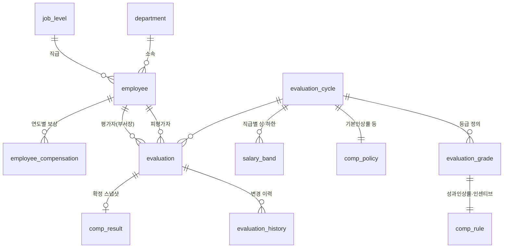

# 업적평가 · 개인 보상 시뮬레이션 시스템 – 스키마 설계안

## 1. 요구사항 정리

| # | 요구사항 | 스키마 대응 |
|---|---------|-------------|
| 1 | 당해 평가결과로 차년도 연봉·인센티브 결정 | `eval_year = N` → `comp_year = N+1` 규칙, `employee_compensation` |
| 2 | 개인평가 5등급 (A~E) | `evaluation_grade` (주기별) |
| 3 | 총인상률 = 기본인상률 + 성과인상률 (D·E 기본인상 미적용) | `comp_policy.base_up_rate` × `comp_rule.base_up_applies` + 성과인상률 |
| 4 | 성과인상률 = 직급별 기준률(CL2>CL3>CL4) × 등급계수(A>B>C, D=0) × 부서 조정계수(A·B, 상위평가율이 낮을수록 높음) | `comp_level_rate`, `comp_rule.perf_factor`, `fn_org_factor`, `fn_perf_rate` + 트리거 검증 |
| 5 | 인센티브는 A·B 등급만 지급 | `evaluation_grade.incentive_eligible` + 계산 함수에서 비대상 0 처리 + 트리거 검증 |
| 6 | 부서장 입력 즉시 차년도 연봉·인센티브 확인 | 웹 화면 + `fn_simulate_comp()` |
| 7 | 전년 대비 증감액 | `delta_base_salary`, `delta_incentive`, `delta_total` |
| 8 | 세부 수치·산식은 추후 확정 | 계산식은 `fn_simulate_comp()` 한 곳, 수치는 `comp_policy`/`comp_rule` 테이블 |

## 2. ERD



## 3. 테이블 요약

| 영역 | 테이블 | 설명 |
|------|--------|------|
| 인사 | `department`, `job_level`, `employee` | 조직(본부-팀/Lab 계층)·직급(CL2/CL3/CL4)·직원 마스터 |
| 계정 | `user_account` | 로그인 계정 (ID = 사번, scrypt 비밀번호 해시, 변경 강제 여부, 실패 횟수·잠금, 최근 로그인) |
| 권한 | `app_user_role` | 시스템 역할 (`HR_ADMIN` = 인사팀 부서별 현황 조회). 부서장 권한은 `department.head_employee_id` 로 자동 부여 |
| 평가 | `evaluation_cycle` | 연 1회 평가주기. 상태: DRAFT → OPEN → CALIBRATION → CONFIRMED → CLOSED. `top_grade_ratio_limit` = 상위평가(A·B) 비율 상한 (40%) |
| | `evaluation_grade` | A~E 등급. `raise_sign`(POSITIVE/ZERO/NEGATIVE), `incentive_eligible`, `is_top_grade`(상위평가율 산정) |
| | `grade_distribution_guide` | 등급별 배분 가이드 (A ≤10% 경고, B ≤30% 안내). `alert_on_exceed` 로 경고 여부 지정 |
| | `evaluation` | 부서장이 입력하는 평가. 직원당 주기별 1건 |
| | `evaluation_history` | 등급·상태 입력/변경 시 트리거로 자동 기록. 변경자는 로그인 사용자 사번 |
| 정책 | `comp_policy` | 기본인상률, 기준 상위평가율(40%)·조정계수 범위(0.7~1.5)·성과인상률 반올림 단위, 절사, 인센티브 기준, 전사 지급률 |
| | `comp_level_rate` | 직급별 기준 성과인상률 (CL2 4% / CL3 3% / CL4 2%) |
| | `comp_rule` | 등급별 등급계수·조정계수 적용 여부·기본인상 적용 여부·인센티브율 (등급당 1건) |
| | `comp_level_grade_override` | 직급 × 등급 고정 성과인상률 (공식보다 우선). E: CL2 0%, CL3·CL4 −10% |
| | `salary_band` | 직급별 연봉 상·하한 (IT 기업 평균 수준 가정) |
| 보상 | `employee_compensation` | 연도별 확정 연봉·인센티브 (전년 대비 계산의 기준) |
| | `comp_result` | 확정 시점 계산 결과 스냅샷 (이후 정책이 바뀌어도 불변) |

### 등급 정책 강제 (`comp_rule` 트리거)

| 등급 | raise_sign | 성과인상률 | 인센티브 |
|------|-----------|-----------|---------|
| A | POSITIVE | 등급계수 > 0 | 지급 |
| B | POSITIVE | 등급계수 > 0 | 지급 |
| C | POSITIVE | 등급계수 > 0 | 0 이어야 함 |
| D | ZERO | 등급계수 = 0, **기본인상 미적용 강제** | 0 이어야 함 |
| E | NEGATIVE | 등급계수 ≤ 0, 직급별 고정값 ≤ 0 | 0 이어야 함 |

규칙에 어긋나는 수치를 넣으면 DB가 오류를 내며 저장을 거부합니다.

## 4. 계산 로직 (성과인상률 산출공식 – 1차 적용안)

```
총인상률       = 기본인상률 2% (D·E 미적용) + 성과인상률
성과인상률     = 직급별 기준 성과인상률 × 등급계수 × 부서 조정계수(A·B 만)   ← 0.1%p 반올림
부서 조정계수  = clamp( 기준 상위평가율 40% ÷ 부서 상위평가율 , 0.7 , 1.5 )
상위평가율     = A·B 인원 ÷ 평가 입력 인원 (평가 단위 부서 기준, 입력할 때마다 재계산)
```

| 직급 | 기준 성과인상률 | | 등급 | 등급계수 | 조정계수 | 기본인상 | 인센티브 |
|------|----------------|-|------|---------|---------|---------|---------|
| CL2 | 4.0% | | A | 1.5 | 적용 | 적용 | 15% |
| CL3 | 3.0% | | B | 1.0 | 적용 | 적용 | 8% |
| CL4 | 2.0% | | C | 0.5 | – | 적용 | – |
| | | | D | 0 (동결) | – | **미적용** | – |
| | | | E | 직급별 고정: CL2 **0%(동결)** · CL3/CL4 **−10%(삭감)** | – | **미적용** | – |

| 부서 상위평가율 | 20% | 30% | 40% | 50% | 60% 이상 |
|---|---|---|---|---|---|
| 조정계수 | ×1.50 | ×1.33 | ×1.00 | ×0.80 | ×0.70 |

- **같은 부서 · 같은 직급 · 같은 등급 → 같은 성과인상률.** 같은 CL4 A라도 부서 상위평가율에 따라 달라집니다.
- 부서가 A·B를 **적게 줄수록 A·B 1인당 성과인상률이 높아지고**, 많이 줄수록 낮아집니다.
  조정계수 범위(0.7~1.5) 안에서는 부서의 A·B 성과인상 재원(인원 × 기준률 × 계수 합)이 상위평가율과 무관하게 일정합니다.
- 하한 0.7 덕분에 조정 후에도 항상 **A > B > C** 가 유지됩니다 (B × 0.7 = 0.7 > C 0.5).
- 예) CL4 A: 상위평가율 20% 부서 → 2% × 1.5 × 1.5 = **4.5%**, 47.5% 부서 → 2% × 1.5 × 0.84 = **2.5%**

현재 수치는 **1차 적용 수치**이며 `comp_policy`, `comp_level_rate`, `comp_rule`, `comp_level_grade_override` 테이블 값만 바꾸면 화면·계산에 그대로 반영됩니다.
- E등급 삭감은 직급 연봉 밴드 하한보다 우선합니다 (밴드 하한은 인상 시에만 적용).
부서장·인사팀 화면 상단의 **'성과인상률 산출공식'** 버튼으로 같은 내용을 팝업으로 볼 수 있습니다.

```
차년 연봉(원)  = 절사(당해 연봉 × (1 + 총인상률), 만원) → 직급 연봉 밴드로 보정 (상한 항상, 하한은 인상 시만)
차년 인센티브  = A·B: 절사(당해 연봉 × 인센티브율 × 전사 지급률 + 정액)  ← 산식 확정 전 임시 / C·D·E: 0
증감액         = 차년 − 당해 (연봉 / 인센티브 / 총보상 각각)
```

**평가 단위**: 부서원은 소속 부서, 부서장은 상위 부서(본부)에서 평가받으며 상위평가율도 그 단위로 계산합니다.

## 5. 처리 흐름

1. **정책 설정 (DRAFT)** – 인사팀이 주기, 등급, `comp_policy`, `comp_rule`, `salary_band` 등록
2. **평가 입력 (OPEN)** – 부서장 웹 화면
   - 등급 선택 시 `PUT /api/departments/{부서}/evaluations/{직원}` → 임시저장 후 `fn_simulate_comp()` 결과를 행에 즉시 반영
   - 화면 하단에서 상위평가(A·B) 비율 확인 – `evaluation_cycle.top_grade_ratio_limit`(40%) 초과 시 경고
   - 전원 입력 후 제출(SUBMITTED) → 수정 잠금
3. **조정 (CALIBRATION)** – 인사팀이 부서별 현황(상위평가율·평균 성과인상률)을 보고 조정, 변경 이력 자동 기록
4. **확정 (CONFIRMED)** – `SELECT fn_confirm_cycle(:cycle)`
   - 미입력/미제출 건, 당해 연봉 누락 건이 있으면 오류
   - `comp_result` 스냅샷 저장 + `employee_compensation`에 차년도 행 생성

## 6. 샘플 실행 결과 (`db/seed_sample.sql`, 모든 수치 임시값)

같은 CL4라도 부서 상위평가율에 따라 A·B 성과인상률이 달라집니다.

| 부서 | 상위평가율 | 조정계수 | CL4 A | CL4 B | CL4 C | CL2 A |
|------|-----------|---------|-------|-------|-------|-------|
| Data Lab | 20.0% | ×1.50 | 4.5% | 3.0% | 1.0% | 9.0% |
| 재무팀 | 29.4% | ×1.36 | 4.1% | 2.7% | 1.0% | 8.2% |
| Cloud Lab (입력 중) | 33.3% | ×1.20 | 3.6% | 2.4% | 1.0% | 7.2% |
| AI Lab | 47.5% | ×0.84 | 2.5% | 1.7% | 1.0% | 5.1% |

(총인상률은 여기에 기본인상률 2%를 더한 값. D는 0%, E는 CL2 0% / CL3·CL4 −10%)

## 7. 결정 필요 사항

1. **세부 수치** – 현재 1차 적용: 기본 2% / 직급 기준률 4·3·2% / 등급계수 1.5·1.0·0.5·0 / E CL2 0%·CL3·CL4 −10% / 기준 40%, 조정계수 0.7~1.5
2. **인센티브 산식** – 기준(당해/차년 연봉, 정액), 전사 성과 연동 여부
3. **연봉 밴드** – 직급별 상·하한을 운영하는지, 상한 초과분 처리(버림/일시금)
4. **평가 대상 기준** – 중도 입사자·휴직자·승진자 처리
5. **다단계 평가** – 1차(팀장·Lab장)·2차(본부장) 평가 여부
6. **권한/보안** – ID/비밀번호 로그인 구현 완료. 인사팀의 조정 권한(현재 조회 전용) 범위, 계정 발급 절차 결정 필요

## 8. 실행 방법

웹앱 실행 방법은 [README](../README.md) 참고. PostgreSQL 15 이상 필요.
