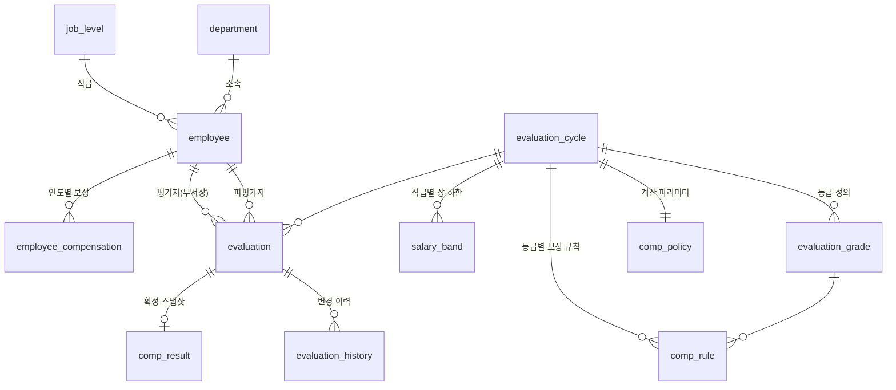

# 업적평가 · 개인 보상 시뮬레이션 시스템 – 스키마 설계안

## 1. 요구사항 정리

| # | 요구사항 | 스키마 대응 |
|---|---------|-------------|
| 1 | 당해 평가결과로 차년도 연봉·인센티브 결정 | `eval_year = N` → `comp_year = N+1` 규칙, `employee_compensation` |
| 2 | 5등급 평가 | `evaluation_grade` (주기별 S/A/B/C/D) |
| 3 | 평가등급 → 연봉등급(인상률) 결정 | `comp_rule` (등급 × 직급 → 연봉등급·인상률·인센티브율) |
| 4 | 부서장 입력 즉시 차년도 연봉·인센티브 확인 | `fn_simulate_comp()` (저장 전 미리보기), `v_comp_simulation` (저장된 평가 기준) |
| 5 | 전년 대비 증감액 | `delta_base_salary`, `delta_incentive`, `delta_total` 컬럼 |
| 6 | 세부 로직은 추후 반영 | 계산식을 `fn_simulate_comp()` 하나에 모으고, 파라미터는 `comp_policy`/`comp_rule`/`salary_band` 테이블로 분리 |

## 2. ERD



## 3. 테이블 요약

| 영역 | 테이블 | 설명 |
|------|--------|------|
| 인사 | `department`, `job_level`, `employee` | 조직·직급·직원 마스터 |
| 평가 | `evaluation_cycle` | 연 1회 평가주기. 상태: DRAFT → OPEN → CALIBRATION → CONFIRMED → CLOSED |
| | `evaluation_grade` | 주기별 5등급 정의 (해마다 명칭·등급 수 변경 가능) |
| | `grade_distribution_guide` | (선택) 등급별 배분 비율 가이드 |
| | `evaluation` | 부서장이 입력하는 평가. 직원당 주기별 1건 |
| | `evaluation_history` | 등급·상태 변경 시 트리거로 자동 기록 (감사 추적) |
| 정책 | `comp_policy` | 절사 단위/방식, 인센티브 기준(당해/차년 연봉), 전사 지급률 |
| | `comp_rule` | 평가등급 → 연봉등급·인상률·인센티브율·정액 인센티브. `job_level_id`가 NULL이면 공통 규칙, 값이 있으면 해당 직급 규칙이 우선 |
| | `salary_band` | (선택) 직급별 연봉 상·하한 |
| 보상 | `employee_compensation` | 연도별 확정 연봉·인센티브 (전년 대비 계산의 기준) |
| | `comp_result` | 확정 시점 계산 결과 스냅샷 (이후 정책이 바뀌어도 불변) |

## 4. 계산 로직 (현재 기본안)

```
당해 연봉      = employee_compensation[comp_year = 평가연도].base_salary
적용 규칙      = comp_rule(주기, 등급, 직급) → 없으면 comp_rule(주기, 등급, 공통)
차년 연봉(원)  = 절사(당해 연봉 × (1 + 인상률), 절사단위)
차년 연봉      = 직급 밴드 [min, max] 범위로 보정 (보정 시 band_capped = true)
차년 인센티브  = 절사(기준연봉 × 인센티브율 × 전사 지급률 + 정액 인센티브)
                 기준연봉 = comp_policy.incentive_base (CURRENT | NEXT)
증감액         = 차년 − 당해 (연봉 / 인센티브 / 총보상 각각)
```

세부 로직이 확정되면 `fn_simulate_comp()` 내부만 수정하면 되고, 화면·뷰·확정 처리는 그대로 재사용됩니다.

## 5. 처리 흐름

1. **정책 설정 (DRAFT)** – 인사팀이 주기, 등급, `comp_policy`, `comp_rule`, `salary_band` 등록
2. **평가 입력 (OPEN)** – 부서장 화면
   - 등급 드롭다운 변경 시 `SELECT * FROM fn_simulate_comp(:cycle, :emp, :grade)` 호출 → 저장 전 실시간 미리보기
   - 저장 후 부서 전체 현황은 `v_comp_simulation WHERE evaluator_id = :me` 로 조회 (부서 총 인상액, 등급 분포 등 집계 가능)
3. **조정 (CALIBRATION)** – 인사팀이 배분 가이드 대비 조정, 변경 이력 자동 기록
4. **확정 (CONFIRMED)** – `SELECT fn_confirm_cycle(:cycle)`
   - 미입력/미제출 건, 당해 연봉 누락 건이 있으면 오류
   - `comp_result` 스냅샷 저장 + `employee_compensation`에 차년도 행 생성

## 6. 샘플 실행 결과 (`db/seed_sample.sql`)

| 직원 | 등급 | 연봉등급 | 인상률 | 당해 연봉 | 차년 연봉 | 연봉 증감 | 차년 인센티브 | 총보상 증감 | 밴드 보정 |
|------|------|---------|--------|-----------|-----------|-----------|---------------|-------------|-----------|
| 이과장 | A | P2 | 6% | 72,000,000 | 76,320,000 | +4,320,000 | 8,640,000 | +7,960,000 | – |
| 박대리 | B | P3 | 4% | 56,500,000 | 58,760,000 | +2,260,000 | 3,390,000 | +2,650,000 | – |
| 최사원 | S | P1 | 8% | 51,000,000 | 52,000,000 | +1,000,000 | 10,200,000 | +11,200,000 | 사원 상한 적용 |
| 김부장(가정: S) | S | P1 | 6% (부장 전용 규칙) | 105,000,000 | 111,300,000 | +6,300,000 | 21,000,000 | +15,300,000 | – |

## 7. 검토 포인트 (결정 필요 사항)

1. **인상 방식** – 등급별 정률 인상만 할지, 동일 등급이라도 *연봉 밴드 내 위치(compa-ratio)* 에 따라 인상률을 차등할지(메리트 매트릭스). 후자라면 `comp_rule`에 위치 구간 컬럼 추가 필요.
2. **인센티브 기준** – 당해 연봉 기준 vs 차년 연봉 기준, 개인 등급 외에 조직(부서) 성과 계수를 곱하는지. 부서 계수가 필요하면 `department_performance(cycle_id, department_id, factor)` 테이블 추가.
3. **연봉 상한 초과분 처리** – 밴드 상한에 걸린 인상분을 버릴지, 일시금(Lump-sum)으로 보전할지.
4. **평가 대상 기준** – 중도 입사자·휴직자·승진자 처리 (근무월수 비례, 승진 시 직급 기준 시점).
5. **다단계 평가** – 1차(팀장)·2차(본부장) 평가가 있다면 `evaluation`을 `evaluation_step` 으로 분리.
6. **예산 통제** – 부서별 인상 재원 한도를 두고 초과 시 경고할지 (`department_budget` 테이블 + 뷰 집계로 구현 가능).
7. **권한/보안** – 연봉은 민감정보이므로 부서장은 자기 부서원만 조회하도록 애플리케이션 권한 + PostgreSQL Row Level Security 적용 권장. 접근 로그 보관 필요 여부 확인.

## 8. 실행 방법

```bash
psql -d <db> -f db/schema.sql
psql -d <db> -f db/seed_sample.sql
psql -d <db> -c "SELECT * FROM v_comp_simulation;"
```

PostgreSQL 15 이상 필요 (`UNIQUE NULLS NOT DISTINCT` 사용).
